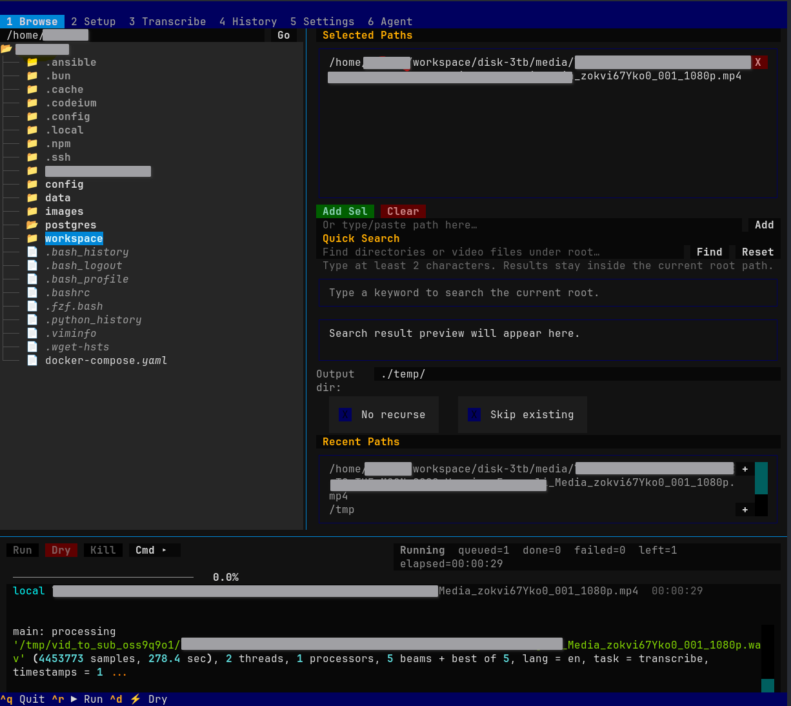
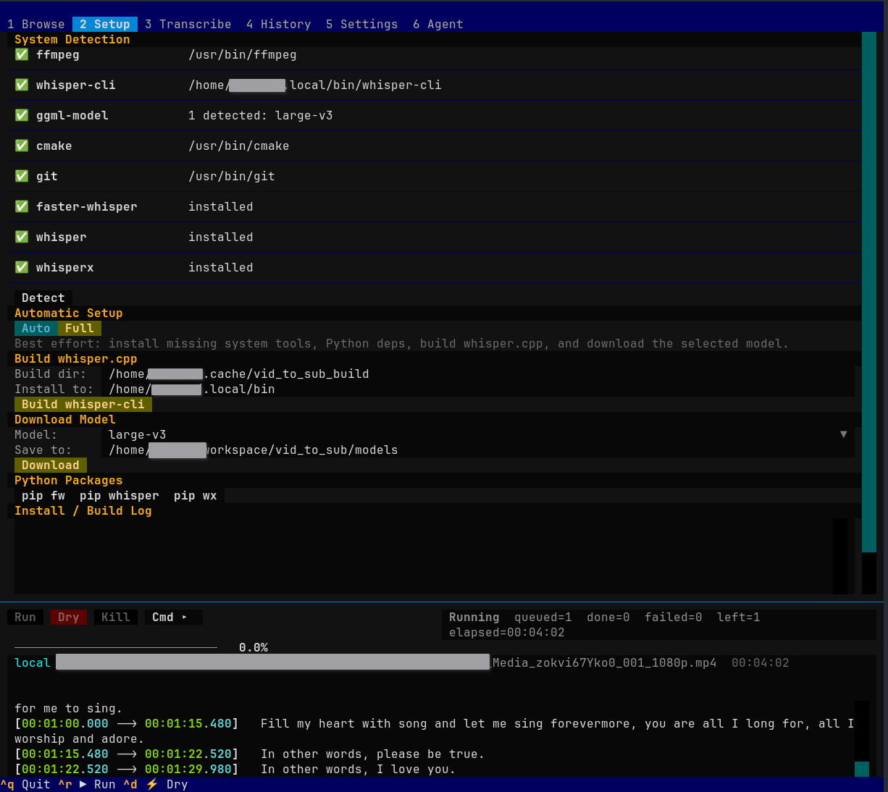
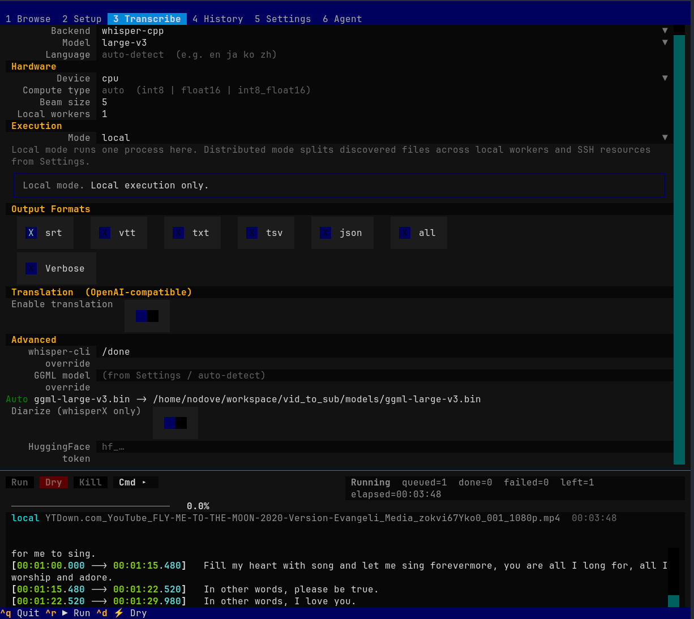
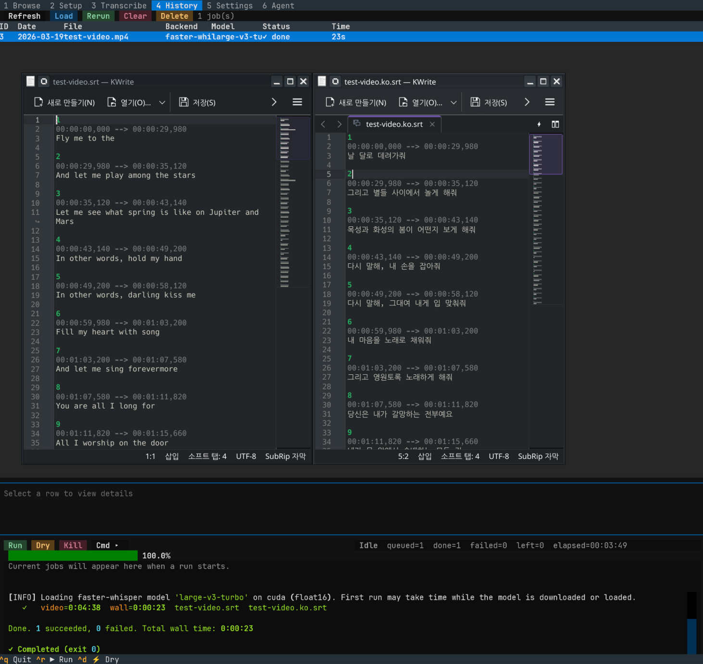

# vid_to_sub

English | [한국어](README.ko.md)

`vid_to_sub` recursively discovers video files and writes subtitle or transcript files next to the source video or into a dedicated output directory. The runtime defaults prefer a GPU-capable backend when the local environment exposes one, and otherwise fall back to CPU transcription through `ffmpeg` + `whisper.cpp`, with optional subtitle translation through an OpenAI-compatible API plus an optional post-editing agent pass for cleanup and correction.

## Screenshots

### Browse inputs and prepare a queue



Use the Browse tab to add folders or individual files, search under the current root, and choose an output directory before starting a run.

### Detect dependencies and install missing pieces



The Setup tab checks for `ffmpeg`, `whisper-cli`, GGML models, and optional Python backends, then exposes install/build actions in one place.

### Configure transcription and translation



The Transcribe tab controls backend, model, device, execution mode, output formats, translation, and advanced overrides.

## What This Project Supports

- Recursive discovery of common video formats such as `mp4`, `mkv`, `mov`, `avi`, `webm`, and `ts`.
- Runtime defaults that prefer `faster-whisper` on detected CUDA, `whisperX` or `openai-whisper` on supported Torch devices, and otherwise fall back to `whisper.cpp` on CPU.
- Optional backends: `faster-whisper`, `openai-whisper`, and `whisperX`.
- Output formats: `srt`, `vtt`, `txt`, `tsv`, `json`, or `all`.
- Optional translation with an OpenAI-compatible chat-completions API while preserving the original subtitle timing boundaries.
- Optional post-editing agent pass with separate model/API settings and an `auto` mode that prefers web lookup when available, then falls back to contextual polishing.
- A 6-tab Textual TUI: Browse, Setup, Transcribe, History, Settings, and Agent.
- SQLite-backed saved settings and job history.
- Optional distributed execution through SSH resource profiles.

## Entry Points

- `python vid_to_sub.py ...`
  CLI entrypoint for recursive discovery and batch transcription.
- `python tui.py`
  Textual TUI entrypoint. On first run it creates a project-local `.venv` and installs missing requirement groups before relaunching.
- `python init_checker.py`
  Bootstrap helper that prepares the managed virtual environment.

## Requirements

### System

- Python 3.9+
- `ffmpeg` on `PATH`
- For the default backend, `whisper-cli` from `whisper.cpp`
- For the default model, `ggml-large-v3.bin`

### Python packages

Base packages:

```bash
pip install -r requirements.txt
```

Optional backend packages:

```bash
pip install -r requirements-faster-whisper.txt
pip install -r requirements-whisper.txt
pip install -r requirements-whisperx.txt
```

## Quick Start

### 1. Default local transcription

```bash
python vid_to_sub.py /path/to/videos
```

By default this:

- scans directories recursively,
- uses model `large-v3`,
- automatically picks the best locally available backend/device, preferring CUDA `faster-whisper`, then Torch-backed `whisperX` or `openai-whisper`, and otherwise CPU `whisper-cpp`,
- when transcription stays on CPU, automatically uses the available CPU threads divided across `--workers`,
- writes `movie.srt` beside each source file.

Use `--backend`, `--device`, or `--backend-threads` when you want to override the runtime defaults explicitly.

### 2. Translate subtitles while keeping the original timing

Set the translation endpoint first:

```bash
export VID_TO_SUB_TRANSLATION_BASE_URL=https://your-host/v1
export VID_TO_SUB_TRANSLATION_API_KEY=your_api_key
export VID_TO_SUB_TRANSLATION_MODEL=your_model
```

Then run:

```bash
python vid_to_sub.py /path/to/videos --translate-to ko
```

To split first-pass translation and a second-pass correction agent, enable post-processing:

```bash
python vid_to_sub.py /path/to/videos --translate-to ko --postprocess-translation
```

You can force a strategy with `--postprocess-mode auto|web_lookup|context_polish`. In `auto`, the second pass is prompted to use lyric/reference lookup when the serving agent supports web search or MCP tools, and otherwise silently falls back to contextual cleanup.

This writes both the original transcription and the translated file, for example:

- `movie.srt`
- `movie.ko.srt`

Only subtitle text changes. `start` and `end` timestamps are copied from the original segments.

Actual output after translating to Korean:



### 3. Use the TUI

```bash
python tui.py
```

Recommended flow inside the TUI:

1. `Browse`: add source folders or files, optionally set `Output dir`, and decide whether `No recurse` or `Skip existing` should be enabled.
2. `Setup`: run dependency detection, install Python backend packages, build `whisper.cpp`, or download a GGML model.
3. `Transcribe`: choose backend, model, device, output formats, translation target, and execution mode.
4. Start with `Ctrl+R`, preview with `Ctrl+D`, stop with `Ctrl+K`.
5. Review previous jobs in `History`, persist defaults in `Settings`, and use `Agent` when you want reviewable guidance or a proposed action plan.

Useful TUI shortcuts:

- `Ctrl+R` run
- `Ctrl+D` dry run
- `Ctrl+K` kill
- `Ctrl+S` save settings
- `1` to `6` switch tabs
- `Ctrl+Q` quit

## Common CLI Examples

Write output files into a separate folder:

```bash
python vid_to_sub.py /path/to/videos -o /path/to/output
```

Disable recursive scan:

```bash
python vid_to_sub.py /path/to/videos --no-recurse
```

Skip videos that already have a primary output:

```bash
python vid_to_sub.py /path/to/videos --skip-existing
```

Preview the queue without running transcription:

```bash
python vid_to_sub.py /path/to/videos --dry-run
```

Write multiple formats:

```bash
python vid_to_sub.py /path/to/videos --format srt --format json
```

Use an explicit `whisper.cpp` model path:

```bash
python vid_to_sub.py /path/to/videos \
  --backend whisper-cpp \
  --model large-v3 \
  --whisper-cpp-model-path /models/ggml-large-v3.bin
```

List built-in model identifiers:

```bash
python vid_to_sub.py --list-models
```

Run transcription only and save a stage artifact for later translation:

```bash
python vid_to_sub.py /path/to/videos --stage1-only --translate-to ko
```

This writes `movie.srt` and a sidecar `movie.stage1.json` next to each source file.
When a translation API becomes available, replay stage 2 on the artifact without
re-transcribing:

```bash
python vid_to_sub.py --translate-from-artifact /path/to/movie.stage1.json
```

To force re-translation even when the artifact already records a completed
translation pass:

```bash
python vid_to_sub.py --translate-from-artifact /path/to/movie.stage1.json --overwrite-translation
```
## Environment Variables

### `whisper.cpp`

- `VID_TO_SUB_WHISPER_CPP_BIN`
  Override the `whisper-cli` executable path.
- `VID_TO_SUB_WHISPER_CPP_MODEL`
  Override the GGML model path.

If `VID_TO_SUB_WHISPER_CPP_MODEL` is not set, the project searches common model directories such as `./models`, `~/.cache/whisper`, `~/models`, `/models`, and `/opt/models`.

### Translation API

- `VID_TO_SUB_TRANSLATION_BASE_URL`
  Accepts either an API root such as `https://host/v1` or the full `/chat/completions` endpoint.
- `VID_TO_SUB_TRANSLATION_API_KEY`
  Bearer token for the translation service.
- `VID_TO_SUB_TRANSLATION_MODEL`
  Model name used for translation.

### Post-edit API

- `VID_TO_SUB_POSTPROCESS_BASE_URL`
  Optional dedicated endpoint for the subtitle post-editing agent. When blank, translation base URL is reused.
- `VID_TO_SUB_POSTPROCESS_API_KEY`
  Optional dedicated Bearer token for post-editing. When blank, translation API key is reused.
- `VID_TO_SUB_POSTPROCESS_MODEL`
  Optional dedicated model for post-editing. When blank, translation model is reused.

### Agent tab

- `VID_TO_SUB_AGENT_BASE_URL`
- `VID_TO_SUB_AGENT_API_KEY`
- `VID_TO_SUB_AGENT_MODEL`

When these are blank in the TUI, the Agent tab falls back to the Translation API settings.

## Distributed Execution

The TUI supports a distributed mode backed by SSH resource profiles. Configure profiles in `Settings -> Remote Resources`, then switch `Execution -> Mode` to `distributed` in the Transcribe tab before starting a run.

Example profile JSON:

```json
[
  {
    "name": "gpu-box",
    "ssh_target": "user@gpu-host",
    "remote_workdir": "/srv/vid_to_sub",
    "slots": 2,
    "path_map": {
      "/mnt/media": "/srv/media"
    },
    "env": {
      "VID_TO_SUB_WHISPER_CPP_MODEL": "/models/ggml-large-v3.bin"
    }
  }
]
```

Field behavior:

- `slots` controls how much work is assigned to that host.
- `path_map` rewrites local path prefixes before the remote command runs.
- `env` injects per-remote environment overrides.

## Output Naming

Default transcription output:

- `movie.srt`
- `movie.vtt`
- `movie.txt`
- `movie.tsv`
- `movie.json`

Translated output with `--translate-to ko`:

- `movie.ko.srt`
- `movie.ko.vtt`
- `movie.ko.txt`
- `movie.ko.tsv`
- `movie.ko.json`

## Recommended Usage Patterns

### Fast local batch transcription

Use the default `whisper.cpp` backend when you want the simplest CPU-only flow with minimal moving parts.

### Translation pass after transcription

Use `--translate-to <lang>` when you already trust the generated subtitle segmentation and only want the text replaced without changing timing.

### Operator workflow through the TUI

Use `tui.py` when you want setup assistance, persistent settings, queue visibility, history, or distributed execution from one terminal UI.

## Notes

- The CLI and TUI share the same runtime backend/device detection, so GPU-capable hosts preselect a matching backend when the optional package is installed.
- `whisperX` diarization needs `--hf-token`; without it, the run continues without diarization.
- Primary outputs are considered existing by filename and format only, so `--skip-existing` checks for files such as `movie.srt` in the target output directory.
- The Settings tab can export the current configuration into `.env`.
